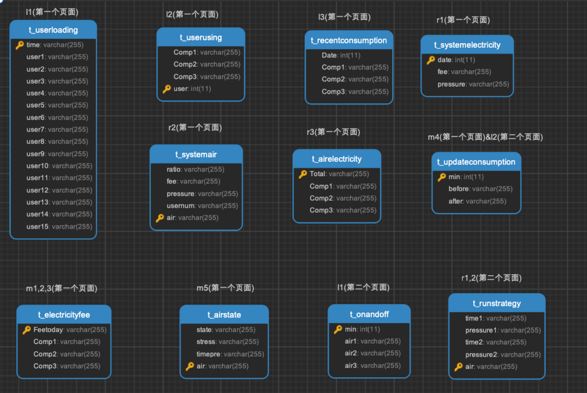

# DigitalTwin

[TOC]

### 用户访问

http://124.223.160.61:888

http://www.senseair.club:888

### 服务器

密码：Zzl2003

IP地址（外网）：124.223.160.61

域名地址：www.senseair.club

### 后端

数据库名：digitaltwin

用户名：digitaltwin

密码：ifdLRBS2w3W3byYz

调试地址：http://localhost:5000/swagger/index.html

### 前端

测试页面：http://localhost:8080/#/dataTest

### 数据库

